# 🚀 Nexora AI

> **The AI Growth Operating System for Modern E-commerce**

<p align="center">
  
</p>

<p align="center">


</p>

---

## 🌟 Overview

Nexora AI is an **AI-native Growth Operating System** designed for modern e-commerce businesses.

Instead of juggling multiple analytics, SEO, competitor tracking, reporting, and AI tools — Nexora centralises everything into **one intelligent platform** powered by Google Gemini AI.

---

## ✨ Core Modules

| Module | Description |
|--------|-------------|
| 📊 Executive Dashboard | High-level KPIs, revenue metrics, and AI insights at a glance |
| ⚔️ Competitor Intelligence | Live monitoring of competitor pricing, keywords, and launches |
| 👥 Customer Intelligence | Sentiment analysis, reviews, retention, and segmentation |
| 💡 Revenue Opportunities | AI-ranked SEO, CRO, and pricing opportunities |
| 📈 Trend Radar | Early detection of market and search trends |
| 📄 AI Reports | Daily, weekly, monthly, and executive PDF reports |
| 🤖 Nora AI Assistant | Conversational AI Growth Officer (chat + voice) |
| ⚙️ Background Jobs | Automated scans and scheduled AI pipelines |
| 🔐 Secure Authentication | Google OAuth and email-based auth with RLS |
| ⚙️ Settings & Integrations | Store profile, API configuration, and integrations |

---

## 🤖 AI Agents

| Agent | Responsibility |
|-------|----------------|
| Growth Agent | Revenue opportunities and growth actions |
| Competitor Agent | Real-time market and competitor tracking |
| Customer Agent | Sentiment analysis and review monitoring |
| SEO Agent | Organic search optimisation |
| GEO Agent | AI search engine visibility (Perplexity, ChatGPT) |
| Report Agent | Automated executive report generation |
| Automation Agent | Background scans and scheduled workflows |
| **Nora** | Conversational AI Growth Officer — chat & voice |

---

## 🔄 How Nexora Works

```text
Connect Store
      ↓
Business Analysis
      ↓
Competitor Analysis
      ↓
Customer Intelligence
      ↓
Trend Detection
      ↓
Gemini AI Processing
      ↓
Actionable Recommendations
      ↓
Dashboard + Reports + Voice
```

---

## 📊 Feature Showcase

### 🏠 Dashboard — Overview

The Nexora AI dashboard gives you an instant read on your store's health — Growth Score, Revenue Lift, and open Opportunities — with a revenue impact chart and a highlighted top AI action, all in a single view.

<p align="center">
  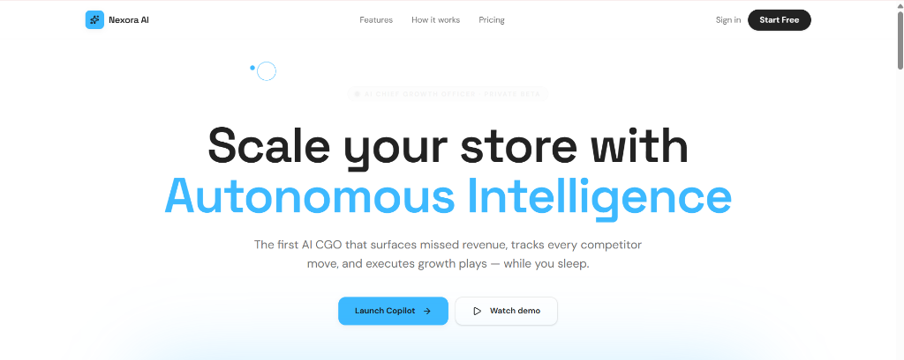
</p>

> *"Scale your store with Autonomous Intelligence"* — The first AI CGO that surfaces missed revenue, tracks every competitor move, and executes growth plays while you sleep.

---

<p align="center">
  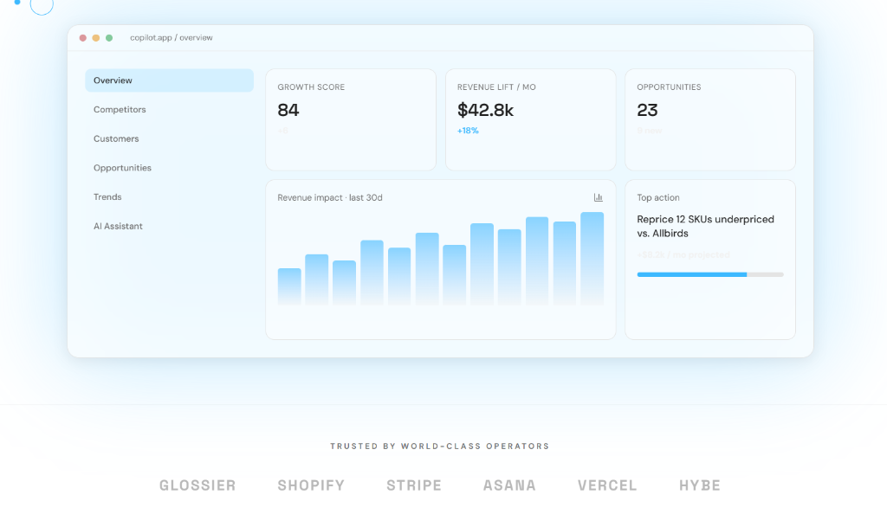
</p>

> The **Overview** panel surfaces your Growth Score (84), monthly Revenue Lift ($42.8k, +18%), and 23 ranked Opportunities — plus a 30-day revenue impact chart and your top recommended action.

---

### 💡 Core Intelligence Modules

Nexora AI replaces a dozen fragmented tools with a single unified intelligence engine — Revenue Opportunities, Competitor Moves, Customer Voice, Conversational Growth, Trend Radar, SEO·AEO·GEO, and Exec Reports.

<p align="center">
  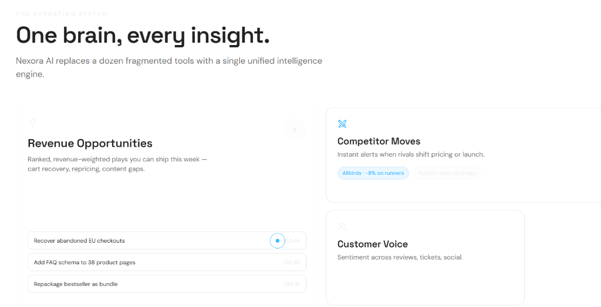
</p>

> **Revenue Opportunities** surfaces ranked, revenue-weighted plays you can ship this week. **Competitor Moves** fires instant alerts when rivals shift pricing or launch new products. **Customer Voice** aggregates sentiment across reviews, tickets, and social.

---

<p align="center">
  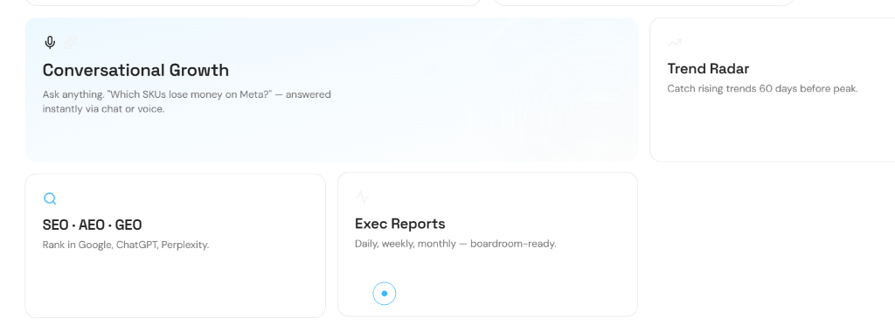
</p>

> **Conversational Growth** (Nora) answers any question by voice or chat. **Trend Radar** catches rising trends 60 days before peak. **SEO · AEO · GEO** ranks you in Google, ChatGPT, and Perplexity. **Exec Reports** deliver daily, weekly, and monthly boardroom-ready summaries.

---

### 🚀 Getting Started — Four Steps

From sign-up to your first revenue lift, Nexora is live in under an hour.

<p align="center">
  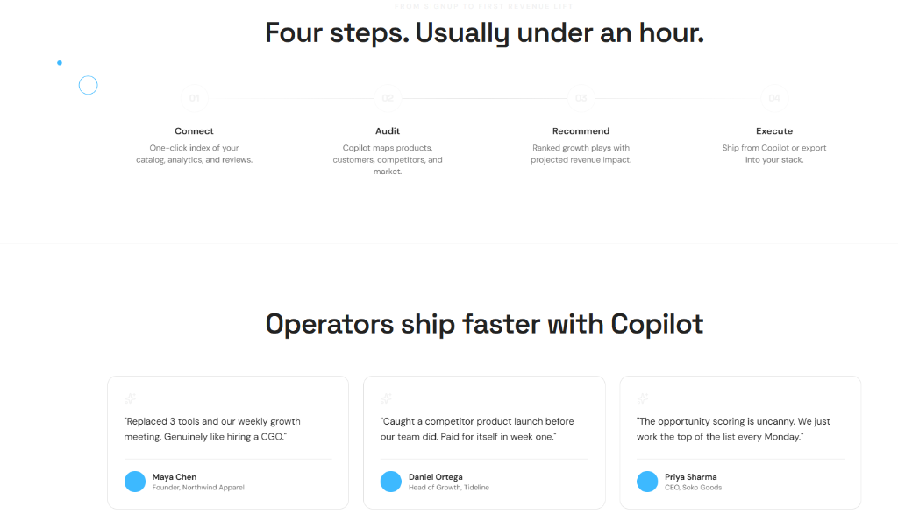
</p>

> **Connect** your catalog, analytics, and reviews → **Audit** as Copilot maps products, customers, competitors, and market → **Recommend** with ranked growth plays and projected revenue impact → **Execute** directly from Nexora or export into your stack.

---

### ⚙️ Settings & Integrations

Configure your store profile, industry vertical, category tags, and connect your Gemini and Supabase API keys — all from a clean, unified settings page.

<p align="center">
  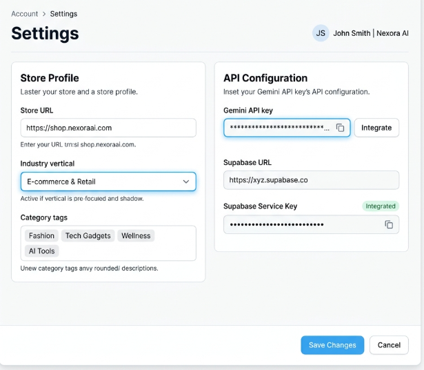
</p>

> Manage your **Store Profile** (URL, industry, tags) and **API Configuration** (Gemini key, Supabase URL & service key) in one place.

---

### 📄 AI Reports

Generate daily, weekly, monthly, and executive reports powered by Gemini AI. Browse past reports and preview Nexora AI insights inline.

<p align="center">
  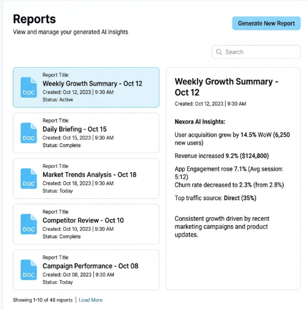
</p>

> Reports are automatically created and stored. Click any report to view detailed AI insights including user acquisition, revenue, engagement, and churn metrics.

---

### 🤖 Nora — AI Chat Assistant

Ask Nora anything about your store's performance, optimisation strategies, SEO, GEO visibility, or growth actions. Nora responds with structured, actionable recommendations.

<p align="center">
  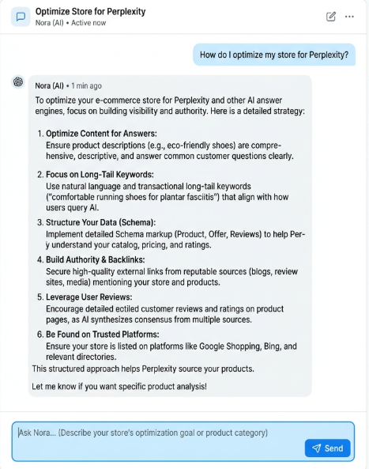
</p>

> *Example: "How do I optimise my store for Perplexity?"* — Nora responds with a detailed, step-by-step GEO strategy.

---

### 🎤 Nora — Voice Assistant

Interact with Nora hands-free using natural voice. Nora listens, processes your request through Gemini AI, and responds in voice — with a live animated waveform.

<p align="center">
  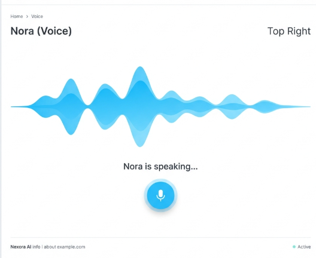
</p>

> The voice UI displays a real-time audio waveform when Nora is speaking, giving an intuitive, premium experience.

---

### ⚙️ Background Jobs & Automation

Review and manage all automated tasks executed by Nexora AI — including SEO scans, competitor movement scans, content analysis, and backlink audits.

<p align="center">
  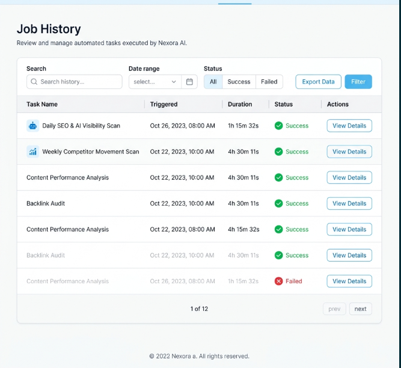
</p>

> Filter by date, status (Success / Failed), or task name. Paginate through up to 12 pages of job history with full task durations and details.

---

## 🏗 Architecture

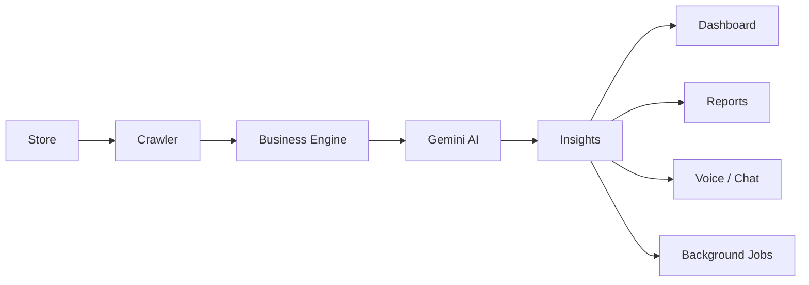

---

## 🛠 Tech Stack

| Layer | Technology |
|-------|------------|
| Frontend | React 19 |
| Routing | TanStack Start |
| Styling | Tailwind CSS v4 |
| Backend | Supabase (Edge Functions) |
| Database | PostgreSQL (via Supabase) |
| AI | Google Gemini |
| Charts | Recharts |
| Auth | Supabase Auth + Google OAuth |
| Scheduling | pg_cron (via Supabase) |

---

## 📁 Repository Structure

```text
commerce-copilot-main/
├── src/
│   ├── components/        # Shared UI components
│   ├── hooks/             # Custom React hooks
│   ├── lib/
│   │   ├── engines/       # AI & data engines (competitor, trends, etc.)
│   │   ├── api/           # API & automation functions
│   │   └── config.server  # Server-side configuration
│   ├── routes/            # TanStack Start route definitions
│   ├── router.tsx         # App router setup
│   ├── styles.css         # Global styles
│   └── start.ts           # App entry point
├── db/                    # Database setup & pg_cron SQL scripts
├── supabase/              # Supabase project config & migrations
├── public/                # Static assets (favicon, manifest)
├── assets/
│   └── screenshots/       # UI screenshots used in README
├── tests/                 # Test suite
├── package.json
├── tsconfig.json
└── vite.config.ts
```

---

## 🔐 Security

- **Google OAuth** — Secure single sign-on
- **Email Auth** — Email + password with verification
- **Supabase RLS** — Row-Level Security on all tables
- **Rate Limiting** — API-level request throttling
- **Input Validation** — Schema-validated inputs
- **CSP** — Content Security Policy headers
- **Secure Environment Variables** — No secrets committed to source

---

## ⚡ Performance Goals

- ✅ Lighthouse Score 95+
- ✅ Mobile-First Responsive Design
- ✅ SSR Ready (TanStack Start)
- ✅ Optimised Production Bundles
- ✅ Lazy-loaded routes and components

---

## 🗺 Roadmap

### ✅ Completed

- [x]# 🗺️ Completed Features

- ✅ Executive Dashboard
- ✅ Competitor Intelligence
- ✅ Customer Intelligence
- ✅ Revenue Opportunities
- ✅ Trend Radar
- ✅ AI Reports
- ✅ Nora AI Chat Assistant
- ✅ Nora Voice Assistant
- ✅ Job History & Background Tasks
- ✅ Google OAuth Authentication
- ✅ Email Authentication
- ✅ Settings & API Integrations
- ✅ Responsive UI
- ✅ Modern Dashboard Design


## 🤝 Contributing

1. **Fork** the repository
2. **Create** a feature branch — `git checkout -b feature/your-feature`
3. **Commit** your changes — `git commit -m "feat: add your feature"`
4. **Push** to the branch — `git push origin feature/your-feature`
5. **Open** a Pull Request

Please follow the existing code style and ensure all tests pass before submitting.

---

## 📄 License

This project is licensed under the **MIT License** — see the [LICENSE](./LICENSE) file for details.

---

<p align="center">
  <strong>Nexora AI — The AI Growth Operating System</strong><br/>
  Built with ❤️ using React 19, TanStack Start, Tailwind CSS v4, Supabase, and Google Gemini AI.<br/><br/>
  ⭐ <em>Star the repository if you find it useful!</em>
</p>
